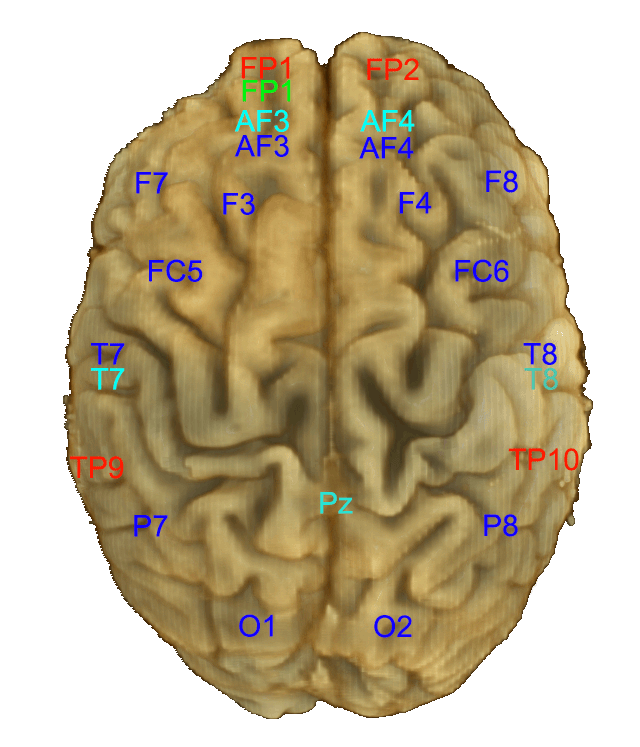
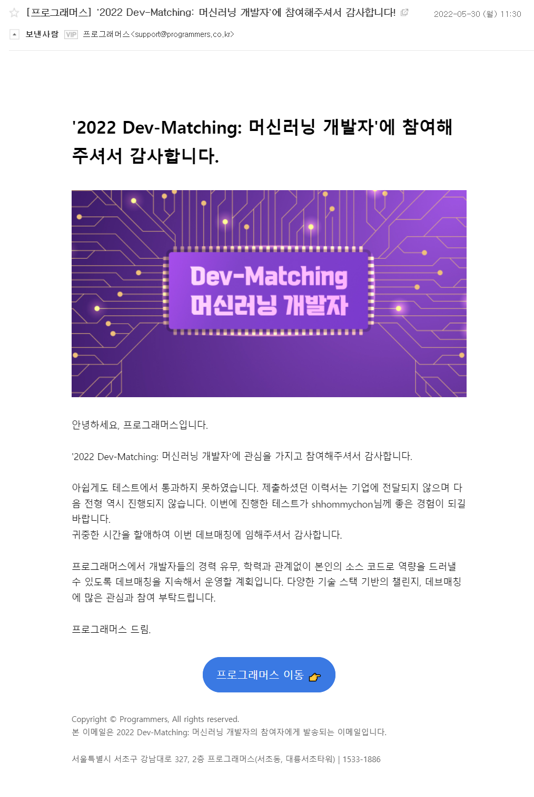

# 2022 Dev-Matching: 머신러닝 과제테스트

- [프로그래머스 데브매칭](https://programmers.co.kr/competitions/2363/2022-machinelearning)은 이력서 한 장으로 다양한 기업에 동시 지원할 수 있는 채용 프로그램이며, 신청한 5곳의 기업에 테스트 점수가 이력서와 함께 전달된다.
- 접수: 22년 05월 09일 10:00 ~ 05월 26일 17:00
- 테스트: 22년 05월 28일 10:00 ~ 05월 28일 22:00
- 출제자 해설: [프로그래머스 블로그](https://prgms.tistory.com/)

## 과제 정보

### 공개 과제 테스트 정보

- 시계열 데이터가 주어집니다.
- 과제 테스트를 진행 할 수 있는 시간은 12시간 입니다.
- 과제 제출 시 리더보드에 내 점수가 기록되며, 다른 지원자들의 점수도 확인할 수 있습니다.
- (이외의 내용을 추가로 공개하면 안된다는 서약서를 썼음)

### 내가 복원한 과제 테스트 내용

- 실제 테스트와 최대한 비슷한 데이터를 찾아서 유사하게 문제를 만들어보았다.

>  **뇌파 시계열 데이터를 사용하여 피실험자가 본 이미지 분류**

#### 데이터 구조 설명 및 채점 기준 안내

##### 문제

- 오픈소스 데이터셋의 서브셋인 dataset0, dataset1가 주어진다.
- 먼저 dataset0을 사용하여 모델을 훈련한 후, 다른 데이터셋인 dataset1에 전이하여 dataset1 test 데이터에 대한 일반화된 예측 성능의 결과를 채점한다.
- dataset0은 총 16개의 이미지 종류(class)를 포함하고, dataset1은 총 10개의 종류를 포함한다.
- dataset0과 dataset1의 피쳐가 동일하되 타겟 레이블의 종류는 서로 다르도록 데이터셋을 준비하였다.

##### 목적

- 주어진 데이터를 활용하여 F1 score(macro)를 최대로 높일 것.

##### 데이터 셋 설명

- 데이터 셋은 EEG(electroencephalography, 뇌전도 기술) 장치를 이용하여 수집한 "AF3", "AF4", "T7", "T8", "PZ" 총 5종의 뇌파 데이터로 구성되어 있다.
  - 
    출처: http://www.mindbigdata.com/opendb/imagenet.html
- 하나의 뇌파 시퀀스는 한개의 csv 파일에 저장되어 있으며, dataset0과 dataset1 모두 column 명이 동일하다.
- 따라서 하나의 csv 파일은 [5(channel) * Sequence Length] 으로 이루어져 있다. 그리고 같은 데이터셋에 포함되어 있다면 모두 같은 시퀀스 길이를 갖는다.
- 이 과제에는 주어진 Python 스크립트로 제공되는 데이터만 사용해야 한다.
  - dataset0는 [MindBigData-Imagenet](http://www.mindbigdata.com/opendb/imagenet.html)의 서브셋이며, Imagenet 데이터를 인간 피실험자에게 보여줬을 때의 뇌파 데이터로 구성되어 있다. `python prepare_dataset0.py`로 다운받을 수 있다.
  - dataset1는 [MindBigData-MNIST](http://mindbigdata.com/opendb/index.html)의 서브셋이며, MNIST 데이터를 인간 피실험자에게 보여줬을 때의 뇌파 데이터로 구성되어 있다. `python prepare_dataset1.py`로 다운받을 수 있다.

---

**시험 결과**

**시험 소감**

- 나름 기발한 아이디어라고 생각했는데 잘 안돼서 아쉬움
- 다른 일정들 때문에 저녁 7시에 시작해서 3시간 밖에 못 투자한 것도 아쉬움
- 다뤄보기 힘든 종류의 데이터였어서 흥미로웠음
- 자체로 테스트 해봤을 떄 점수가 리더보드 1등보다 훨씬 높게 나와서 좋아했는데 제출하니 0점이 나와서 충격이었음
- PyTorch 기본 코딩 속도를 높혀야겠다는 생각도 들었음